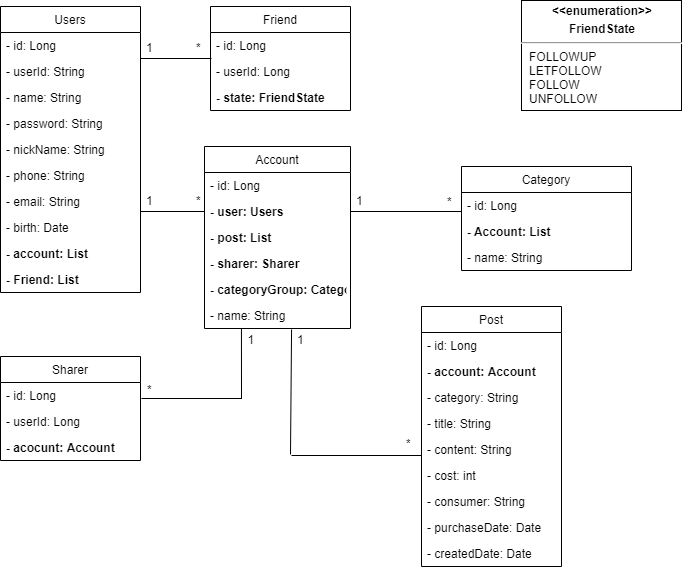

# gongbu_server
공용가계부 서버

# 환경
Docker  
PostgreSQL  
Spring Boot  
JPA/Hibernate  
MVC Pattern  
JUnit  

# 주요기능
### 회원 기능
- 회원가입
- 로그인

### 친구 기능
- 친구 등록
- 친구 승인
- 친구 조회

### 가계부 기능
- 가계부 등록
- 가계부 조회
- 가계부 수정
- 공유자 등록

### 가계부 내용 기능
- 내용 등록
- 내용 조회
- 내용 수정

### 카테고리 기능
- 카테고리 등록
- 카테고리 조회
- 카테고리 수정

# UML
  

# ERD
  
